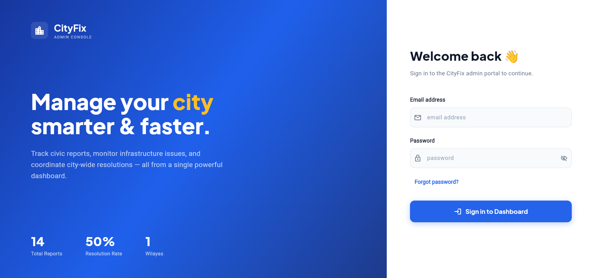
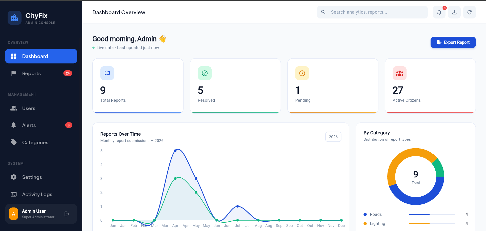
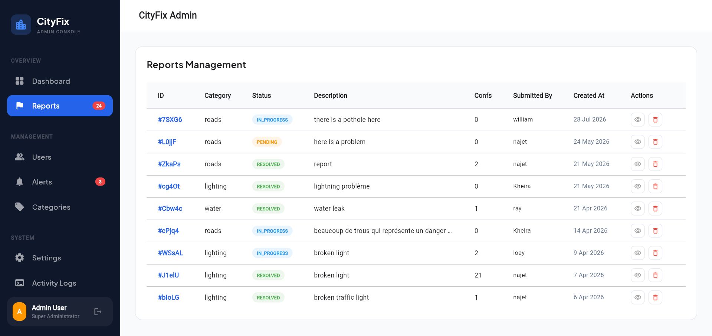
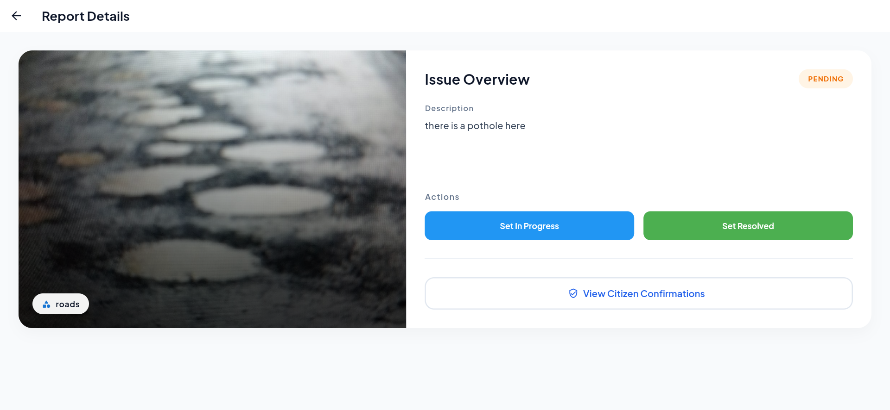

# CityFix Admin Dashboard

The CityFix Admin Dashboard is a web application developed as part of our university graduation project. It enables administrators to review, verify, and manage citizen-submitted urban issue reports through a centralized interface.

## Features

- View all submitted reports
- Review report details and attached images
- Track  and modify report status (Pending, In Progress, Resolved)
- displays key statistics such as total reports, resolved reports, pending reports, and active citizens
- Secure administrator authentication

## Tech Stack

- Flutter (Web)
- Dart
- Firebase Authentication
- Cloud Firestore
- cloudinary

### Prerequisites

- Flutter SDK >= 3.38.9
- Firebase project configured

## License

This project is provided for portfolio and demonstration purposes only.
No part of this source code may be copied, modified, or redistributed without explicit permission from the authors.

## Screenshots

### Login

### Dashboard

### Reports

### Report Details

